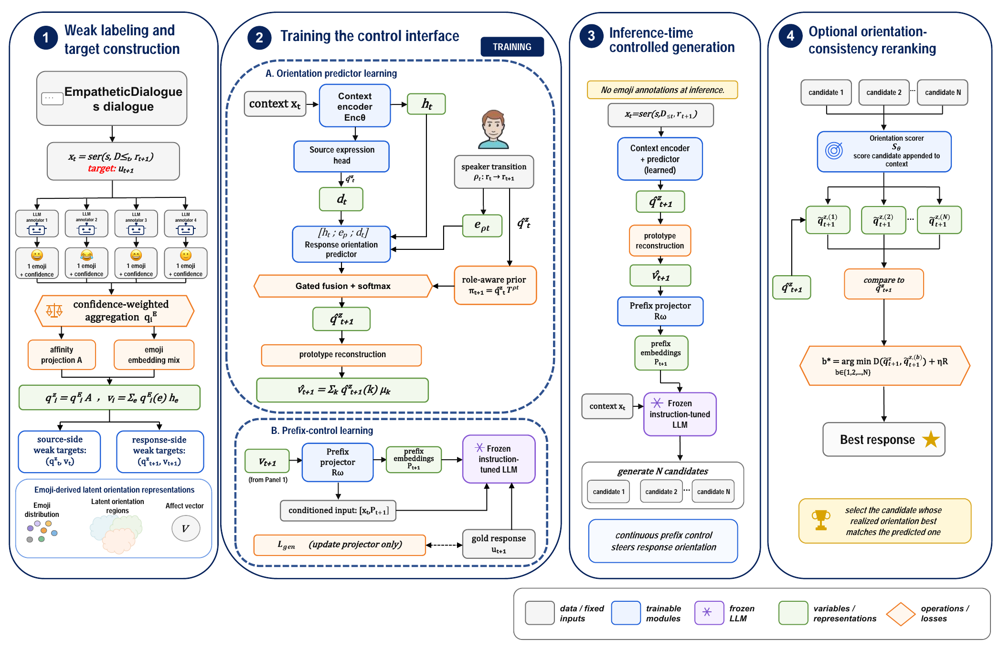

# EmoStance: Response-Side Affective-Orientation Control for Empathetic Response Generation via Emoji Weak Supervision

[简体中文](README_zh-CN.md)

Official code and reconstruction artifacts for:

> Ziyuan Jin, Yuxuan Ge, and Zheng Tian†  
> ShanghaiTech University · †Corresponding author

[Paper PDF](paper/EmoStance.pdf) · [Paper information and abstract](docs/PAPER.md) · [Reproduction guide](docs/REPRODUCTION.md)



## Overview

EmoStance treats multi-annotator emoji distributions as weak affective–attitudinal evidence, not as output symbols, gold emotion labels, or gold listener-stance labels. It induces a name-free latent orientation space, predicts a soft response-side orientation from dialogue context and speaker roles, reconstructs a continuous control vector from cluster prototypes, and steers a frozen instruction-tuned language model through learned prefix embeddings. At inference time, only dialogue text and speaker roles are required.

The repository contains:

- the name-free, train-only emoji graph and clustering pipeline;
- response-orientation preparation, prediction, prototype reconstruction, and ablations;
- continuous prefix-control training for `mistralai/Mistral-7B-Instruct-v0.3`;
- multi-candidate orientation-consistency reranking;
- automatic, human-evaluation, data-audit, and efficiency scripts;
- released emoji-to-region membership and emoji-centroid artifacts;
- text-free EmojiDialogue annotation metadata and reconstruction scripts.

Model weights, the original EmpatheticDialogues text, private annotator exports, and generated run directories are intentionally excluded.

## Repository layout

```text
EmoStance/
├── assets/                         # method figure (PNG and source PDF)
├── configs/                        # paper configuration
├── data/annotation_metadata/       # released text-free EmojiDialogue metadata
├── docs/                           # paper, data, and reproduction notes
├── examples/                       # synthetic smoke-test inputs
├── human_ablation/                 # focused blind-pairwise evaluation scripts
├── human_llm_emoji_audit/          # human–LLM distribution audit scripts
├── data_eval/                      # weak-label plausibility audit scripts
├── rerank_efficiency/              # B=1 versus B=4 timing benchmark
├── system_baseline/                # aligned system-level evaluation harness
├── scripts/                        # reconstruction and ablation utilities
├── src/latent_stance_control/      # EmoStance training and generation code
└── src/name_free_emoji_clustering/ # weak-target construction code
```

## Installation

The reported environment uses Python 3.10.14, PyTorch 2.6.0 with CUDA 11.8, and Transformers 4.46.3. Install the PyTorch build appropriate for your machine first, then install the project:

```bash
python -m venv .venv
source .venv/bin/activate
python -m pip install --upgrade pip
python -m pip install -e ".[clustering,evaluation]"
```

For a lightweight CPU-only code check:

```bash
python -m pip install "numpy==2.2.6" "networkx==3.4.2" "pytest>=8"
PYTHONPATH=src pytest -q tests src/name_free_emoji_clustering/tests human_llm_emoji_audit/tests
```

## Quick smoke test

The synthetic examples do not contain EmpatheticDialogues text and do not download a model:

```bash
python -m latent_stance_control.prepare_data \
  --annotations examples/tiny_annotations.jsonl \
  --clusters examples/tiny_clusters.json \
  --out runs/smoke/prepared
```

The command should create `train.jsonl`, `dev.jsonl`, `meta.json`, and `prepare_summary.json` under `runs/smoke/prepared`.

## Reconstructing EmojiDialogue

The released files under `data/annotation_metadata/` contain dialogue identifiers, turn indices, emoji votes, and confidence scores only. Obtain EmpatheticDialogues separately under its original terms, then join the metadata with the official CSV files locally:

```bash
python scripts/reconstruct_emojidialogue.py \
  --metadata-root data/annotation_metadata \
  --ed-root /path/to/empatheticdialogues \
  --output-root private_data/reconstructed
```

Do not commit `private_data/reconstructed`; it contains the original dialogue text. See [docs/DATA.md](docs/DATA.md) for the schema and release policy.

## Main training flow

After reconstruction, the high-level flow is:

```bash
# Build the name-free space from the training split only.
python -m name_free_emoji_clustering \
  --root private_data/reconstructed \
  --output-dir runs/main/clustering \
  --cluster-splits train

python -m name_free_emoji_clustering.soft_membership \
  --artifact runs/main/clustering/cluster_visualization.html \
  --output-dir runs/main/clustering/soft_membership

# Construct adjacent-turn source/response targets.
python -m latent_stance_control.prepare_data \
  --annotation-root private_data/reconstructed \
  --clusters runs/main/clustering/soft_membership/emoji_cluster_membership.csv \
  --emoji-vectors runs/main/clustering/tables/emoji_centroids.csv \
  --out runs/main/prepared

# Train the role-aware orientation predictor.
python -m latent_stance_control.train_role_aware_stance_predictor \
  --prepared runs/main/prepared \
  --out runs/main/stance_role_aware \
  --model microsoft/deberta-v3-base \
  --epochs 3 --batch-size 8 --lr 1.5e-5 --max-length 320 \
  --focal-gamma 0 --class-weight-power 0.25

# Fit prototype reconstruction and evaluate stance ablations.
python -m latent_stance_control.run_ablations \
  --prepared runs/main/prepared \
  --stance-dir runs/main/stance_role_aware \
  --out runs/main/ablations_role_aware
```

Generator training and decoding require the 7B Mistral backbone and a suitable GPU. Exact commands, c7 gate preparation, three-seed generation, and reranking are documented in [docs/REPRODUCTION.md](docs/REPRODUCTION.md). Paper hyperparameters are recorded in [configs/emostance_main.json](configs/emostance_main.json).

## Data and artifact policy

- Code is released under the [MIT License](LICENSE).
- Released EmojiDialogue metadata and derived stance artifacts are for non-commercial research under [data-specific terms](data/DATA_LICENSE.md) compatible with the original EmpatheticDialogues restrictions.
- The annotation layer is weak supervision. It must not be treated as gold emotion annotation, diagnosis, protected-attribute inference, user profiling, or evidence of a speaker's true internal state.
- The repository contains no API keys, model weights, original dialogue text, or raw API logs.

## Citation

```bibtex
@misc{jin2026emostance,
  title  = {EmoStance: Response-Side Affective-Orientation Control for Empathetic Response Generation via Emoji Weak Supervision},
  author = {Jin, Ziyuan and Ge, Yuxuan and Tian, Zheng},
  year   = {2026},
  url    = {https://github.com/18277390221/EmoStance}
}
```

Machine-readable citation metadata is available in [CITATION.cff](CITATION.cff).
